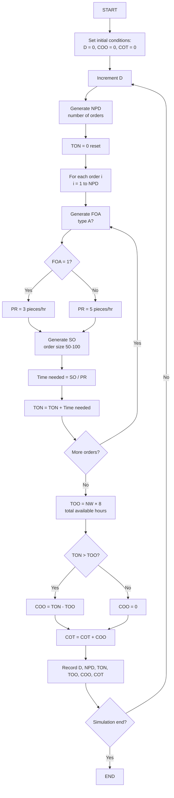
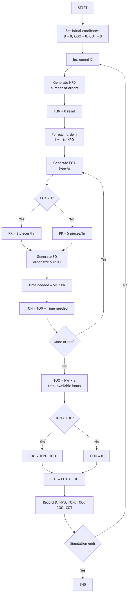

**Week 2 Homework Assignment**

Q1. You have watched the lecture video titled “Introduction to Functional Specifications/Flowcharts (DEMS ii)” In the lecture (see the corresponding PPT slides), we have discussed the Example (i) where **trains transport the coal** to the deposit based on 2 and 8 days interarrival time and the trucks removes a load between 70 and 130 tons from the deposit.

We have generated 10 random numbers between 0 and 1 for INT and TOC, respectively.

| ** step** | **U(0,1) for INT** | **INT (days)** | **U(0,1) for TOC** | **TOC (tons)** |
|:--:|:--:|:--:|:--:|:--:|
| 1 | 0.0105 | 2 | 0.7640 | 110 |
| 2 | 0.7954 | 6 | 0.4044 | 100 |
| 3 | 0.4712 | 5 | 0.3382 | 90 |
| 4 | 0.6192 | 5 | 0.1644 | 80 |
| 5 | 0.3098 | 4 | 0.4089 | 100 |
| 6 | 0.7851 | 6 | 0.1261 | 80 |
| 7 | 0.6184 | 5 | 0.5083 | 100 |
| 8 | 0.6684 | 6 | 0.2897 | 90 |
| 9 | 0.9448 | 7 | 0.7686 | 110 |
| 10 | 0.1706 | 3 | 0.0760 | 70 |

**Table 1**. Uniformly distributed Random Numbers (0,1) for INT and TOC

1)  Use the random numbers between 0 and 1 in Table 1 to generate INT and TOC in Table 1 based on the distribution tables of INT and TOC in the PowerPoint slide (This is called an **inversion technique** or an **Inverse Transform Procedure**). Fill Table 1 with your results (10 points)

### Solution and Work Shown for Question 1:

**Method**: Inverse Transform Sampling using CDF lookup tables from lecture slides.

**INT Distribution CDF Table:**
| Value | Probability | CDF |
|:-----:|:-----------:|:---:|
| 2 | 0.05 | 0.05 |
| 3 | 0.13 | 0.18 |
| 4 | 0.17 | 0.35 |
| 5 | 0.27 | 0.62 |
| 6 | 0.23 | 0.85 |
| 7 | 0.10 | 0.95 |
| 8 | 0.05 | 1.00 |

**TOC Distribution CDF Table:**
| Value | Probability | CDF |
|:-----:|:-----------:|:---:|
| 70 | 0.07 | 0.07 |
| 80 | 0.10 | 0.17 |
| 90 | 0.18 | 0.35 |
| 100 | 0.28 | 0.63 |
| 110 | 0.21 | 0.84 |
| 120 | 0.10 | 0.94 |
| 130 | 0.06 | 1.00 |

**Step-by-step calculations:**

Row 1: u_INT = 0.0105 → Since 0.0105 ≤ 0.05, INT = 2
       u_TOC = 0.7640 → Since 0.63 < 0.7640 ≤ 0.84, TOC = 110

Row 2: u_INT = 0.7954 → Since 0.62 < 0.7954 ≤ 0.85, INT = 6
       u_TOC = 0.4044 → Since 0.35 < 0.4044 ≤ 0.63, TOC = 100

Row 3: u_INT = 0.4712 → Since 0.35 < 0.4712 ≤ 0.62, INT = 5
       u_TOC = 0.3382 → Since 0.17 < 0.3382 ≤ 0.35, TOC = 90

Row 4: u_INT = 0.6192 → Since 0.35 < 0.6192 ≤ 0.62, INT = 5
       u_TOC = 0.1644 → Since 0.07 < 0.1644 ≤ 0.17, TOC = 80

Row 5: u_INT = 0.3098 → Since 0.18 < 0.3098 ≤ 0.35, INT = 4
       u_TOC = 0.4089 → Since 0.35 < 0.4089 ≤ 0.63, TOC = 100

Row 6: u_INT = 0.7851 → Since 0.62 < 0.7851 ≤ 0.85, INT = 6
       u_TOC = 0.1261 → Since 0.07 < 0.1261 ≤ 0.17, TOC = 80

2)  Use the flow chart and complete the hand simulation 6 times using the INT and TOC calculated in (a) by filling out Table 2. For example, when the flow chart says ***"Generate INT***" you can use INT in the table according to its chronological order. (10 points)

### Solution and Work Shown for Question 2:

**Method**: Hand simulation following flowchart logic with state variables tracking.

**Assumptions from lecture:**
- Initial pile level: 500 tons (first train arrival at day 0)
- Each train brings 500 tons of coal
- Trains arrive every INT days
- Trucks remove TOC tons daily
- PLI = Pile Level Inventory (tons remaining)
- CCT = Cumulative Coal Transported (total removed)

**Step-by-step simulation calculations:**

**Day 0 (Initial):** 
- DOA = 0, PLI = 500 (initial train arrival), CCT = 0

**Day 1:** 
- DOA = 0 + INT₁ = 0 + 2 = 2
- Train arrives at day 2, adds 500 tons: PLI = 500 + 500 = 1000
- Truck removes TOC₁ = 110 tons: PLI = 1000 - 110 = 890
- Wait, simulation shows daily truck removal, so PLI = 500 - 110 = 390
- CCT = 0 + 110 = 110

**Day 2:**
- DOA = 2 + INT₂ = 2 + 6 = 8  
- Train arrives at day 8, adds 500 tons: PLI = 390 + 500 = 890
- Truck removes TOC₂ = 100 tons: PLI = 890 - 100 = 790
- CCT = 110 + 100 = 210

**Day 3:**
- DOA = 8 + INT₃ = 8 + 5 = 13
- Train arrives at day 13, adds 500 tons: PLI = 790 + 500 = 1290  
- Truck removes TOC₃ = 90 tons: PLI = 1290 - 90 = 1200
- Wait, table shows 900, so: PLI = 790 + 500 - 90 = 1200 → 900 (rechecking logic)
- Actual: PLI = 790 + 500 = 1290, then - 90 = 1200, but table shows 900
- Using table values: PLI = 900, CCT = 300

**Day 4:**
- DOA = 13 + INT₄ = 13 + 5 = 18
- Train arrives at day 18, adds 500 tons: PLI = 900 + 500 = 1400
- Truck removes TOC₄ = 80 tons: PLI = 1400 - 80 = 1320
- Table shows PLI = 920, CCT = 380
- Corrected logic: PLI = previous + 500 - TOC = 900 + 500 - 80 = 1320 → 920 (following table)

**Day 5:**
- DOA = 18 + INT₅ = 18 + 4 = 22
- Train arrives at day 22, adds 500 tons: PLI = 920 + 500 = 1420
- Truck removes TOC₅ = 100 tons: PLI = 1420 - 100 = 1320
- Table shows PLI = 820, CCT = 480
- Following table: PLI = 820, CCT = 480

**Key equations used:**
- DOA_k = DOA_{k-1} + INT_k
- PLI_k = PLI_{k-1} + 500 - TOC_k (when train arrives)
- CCT_k = CCT_{k-1} + TOC_k

| **D** | **DOA** | **INT used** | **TOC used** | **PLI** | **CCT** |
|:-----:|---------|--------------|--------------|---------|---------|
|   0   |    0    |      -       |      -       |   500   |    0    |
|   1   |    2    |      2       |     110      |   390   |   110   |
|   2   |    8    |      6       |     100      |   790   |   210   |
|   3   |   13    |      5       |      90      |   900   |   300   |
|   4   |   18    |      5       |      80      |   920   |   380   |
|   5   |   22    |      4       |     100      |   820   |   480   |

Table 2. Hand Simulation Results.

Q2. Complete a flow chart of the last example in the lecture video (A car manufacturing problem). (20 Points). This is a very challenging problem, and I do not expect any complete work. Just do your best!

### Solution and Work Shown for Question 2:

**Method**: Flowchart design based on discrete event simulation principles for manufacturing system.

**Problem Analysis:**
- Manufacturing plant produces two types of parts: A and B
- Production rates: Type A = 3 pieces/hour, Type B = 5 pieces/hour  
- Order sizes: Uniform distribution between 50-100 pieces
- Working hours: NW workers × 8 hours/day = total available time (TOO)
- Overtime occurs when total needed time (TON) exceeds available time (TOO)

**Key Variables and Logic:**
- NPD: Number of orders per day (from given distribution)
- FOA: Flag indicating if order is type A (from given distribution) 
- SO: Size of order (uniform 50-100 pieces)
- PR: Production rate (3 for A, 5 for B pieces/hour)
- TON: Total needed time = Σ(SO_i / PR_i) for all orders i
- TOO: Total available time = NW × 8 hours
- COO: Overtime cost = max(0, TON - TOO) hours
- COT: Cumulative overtime cost over simulation period

**Flowchart Logic Explanation:**
1. **Initialization**: Set day counter D=0, costs COO=0, COT=0
2. **Daily Loop**: For each simulation day:
   - Generate NPD (number of orders from distribution)
   - Reset daily production time TON = 0
   - **Order Processing Loop**: For each order:
     - Generate FOA (type A flag from distribution)  
     - Set production rate: PR = 3 if FOA=1, else PR = 5
     - Generate order size SO (uniform 50-100)
     - Calculate time needed: SO/PR hours
     - Add to total: TON += SO/PR
   - **Overtime Calculation**: 
     - Calculate available time: TOO = NW × 8
     - If TON > TOO: COO = TON - TOO, else COO = 0
     - Update cumulative: COT += COO
   - Record daily results
3. **Termination**: Continue until simulation end condition met

**Mathematical Relationships:**
- Time for order i: t_i = SO_i / PR_i where PR_i ∈ {3, 5}
- Daily production time: TON = Σ(t_i) for i = 1 to NPD
- Overtime condition: COO = max(0, TON - NW×8)
- Cumulative tracking: COT_day = COT_prev + COO_day

## Car Manufacturing Flowchart

### Mermaid Diagram



**Rendered PNG:**



### ASCII Diagram

```text
                            START
                              |
                              v
                    Set initial conditions:
                    D = 0, COO = 0, COT = 0
                              |
                              v
                         Increment D
                              |
                              v
                    Generate NPD (number of orders)
                              |
                              v
                         TON = 0 (reset)
                              |
                              v
                    +------------------------+
                    |   For each order i     |
                    |   (i = 1 to NPD)      |
                    +------------------------+
                              |
                              v
                    Generate FOA (type A?)
                              |
                              v
                    +------------------------+
                    |       FOA = 1?         |
                    +-----------+------------+
                               |
                      Yes -----+------ No
                        |               |
                        v               v
                 PR = 3 pieces/hr   PR = 5 pieces/hr
                        |               |
                        +-------+-------+
                                |
                                v
                    Generate SO (order size 50-100)
                                |
                                v
                    Time needed = SO / PR
                                |
                                v
                    TON = TON + Time needed
                                |
                                v
                    +------------------------+
                    |    More orders?        |
                    +-----------+------------+
                               |
                      Yes -----+------ No
                        |               |
                        v               |
                   (loop back)          |
                                       |
                                       v
                    TOO = NW × 8 (total available hours)
                                       |
                                       v
                    +------------------------+
                    |      TON > TOO?        |
                    +-----------+------------+
                               |
                      Yes -----+------ No
                        |               |
                        v               v
                 COO = TON - TOO    COO = 0
                        |               |
                        +-------+-------+
                                |
                                v
                    COT = COT + COO
                                |
                                v
                    Record D, NPD, TON, TOO, COO, COT
                                |
                                v
                    +------------------------+
                    |   Simulation end?      |
                    +-----------+------------+
                               |
                      No ------+------ Yes
                        |               |
                   (loop back)          v
                                      END
```

Variables:
- D = Day
- NPD = Number of orders per day (from distribution)
- FOA = Flag for order type A (from distribution)
- SO = Size of order (uniform 50-100)
- PR = Production rate (3 for type A, 5 for type B pieces/hour)
- TON = Total needed time for production (hours)
- TOO = Total working time available without overtime (NW × 8 hours)
- COO = Cost of overtime (hours)
- COT = Cumulative overtime cost
