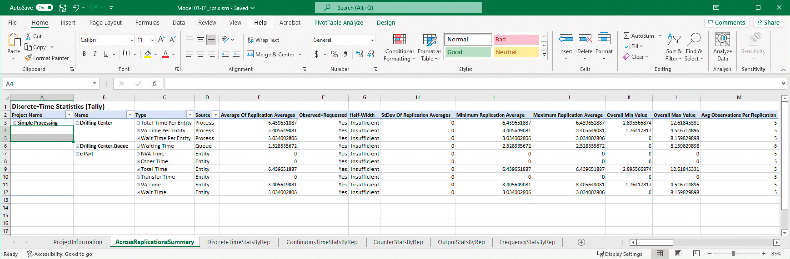

# Lab01 Arena Model Build Instructions

## Model 3-1 (OAPM1): Simple Processing System - Drilling Center

### Overview
A basic single-server queue system where parts arrive, get processed at a drilling center, then leave.

### Build Steps

1. **Create Module**
   - Drag Create module from Basic Process panel
   - Name: "Part Arrives to System"
   - Entity Type: "Entity 1" (default)
   - Type: Random (Expo)
   - Value: 5
   - Units: Minutes (per slide 689: example shows Value=5, Units=Minutes)
   - Entities per Arrival: 1
   - Max Arrivals: Infinite
   - First Creation: 0.0

2. **Process Module**
   - Drag Process module from Basic Process panel
   - Name: "Drilling Center"
   - Type: Standard
   - Action: Seize Delay Release
   - Resources: Add "r Drill Press"
   - Delay Type: Triangular
   - Minimum: 1, Value (Most Likely): 3, Maximum: 6
   - Units: Minutes
   - Allocation: Value Added
   - Report Statistics: Checked

3. **Dispose Module**
   - Drag Dispose module from Basic Process panel
   - Name: "Exit System" or "Part Leaves System"
   - Record Entity Statistics: Yes

4. **Connect Modules**
   - Connect: Part Arrives to System → Drilling Center → Exit System
   - All three modules should be connected with arrows

5. **Run Settings**
   - Run → Setup → Replication Parameters tab
   - Replication Length: 20
   - Time Units: Minutes (per slide 681: Time axis shows 0-20 minutes)
   - Number of Replications: 1
   - Warm-up Period: 0
   - Click OK

---

## Model 3-2 (OAPM2): Specialized Serial Processing - Loan Application

### Overview
A multi-stage serial processing system for loan applications with 4 sequential processing steps through specialized employees.

### Build Steps

1. **Create Module**
   - Drag Create module from Basic Process panel
   - Name: "Application Arrives"
   - Entity Type: "Application" (set this specifically)
   - Type: Random (Expo)
   - Value: 1.25
   - Units: Hours
   - Entities per Arrival: 1
   - Max Arrivals: Infinite
   - First Creation: 0.0

2. **Process Module 1: Ali Checks Credit**
   - Name: "Ali Checks Credit"
   - Type: Standard
   - Action: Seize Delay Release
   - Resources: Add "r Ali"
   - Delay Type: Expression
   - Expression: EXPO(1)
   - Units: Hours
   - Allocation: Value Added
   - Report Statistics: Checked

3. **Process Module 2: Bianca Prepares Covenant**
   - Name: "Bianca Prepares Covenant"
   - Type: Standard
   - Action: Seize Delay Release
   - Resources: Add "r Bianca"
   - Delay Type: Expression
   - Expression: EXPO(1)
   - Units: Hours
   - Allocation: Value Added
   - Report Statistics: Checked

4. **Process Module 3: Carl Prices Loan**
   - Name: "Carl Prices Loan"
   - Type: Standard
   - Action: Seize Delay Release
   - Resources: Add "r Carl"
   - Delay Type: Expression
   - Expression: EXPO(1)
   - Units: Hours
   - Allocation: Value Added
   - Report Statistics: Checked

5. **Process Module 4: Deeta Disburses Funds**
   - Name: "Deeta Disburses Funds"
   - Type: Standard
   - Action: Seize Delay Release
   - Resources: Add "r Deeta"
   - Delay Type: Expression
   - Expression: EXPO(1)
   - Units: Hours
   - Allocation: Value Added
   - Report Statistics: Checked

6. **Dispose Module**
   - Name: "Application Departs"
   - Record Entity Statistics: Yes

7. **Connect Modules**
   - Connect: Application Arrives → Ali Checks Credit → Bianca Prepares Covenant → Carl Prices Loan → Deeta Disburses Funds → Application Departs

8. **Run Settings**
   - Run → Setup → Replication Parameters tab
   - Replication Length: 160
   - Time Units: Hours
   - Number of Replications: 1
   - Warm-up Period: 0
   - Click OK

---

## Running and Reporting

1. **Run the Simulation**
   - Click Run → Go
   - Wait for completion dialog "The simulation has run to completion. Would you like to see the results?"
   - Click Yes

2. **Capture Results**
   - Arena will show a report with statistics
   - Take screenshot or export the report
   - Key metrics to capture:
     - Total WIP (Work In Progress) Average/Max
     - Total Time in System Average/Max
     - Total Waiting Time Average/Max
     - Number Processed
     - Average Utilization (for each resource)

3. **Submit**
   - Save both .doe model files
   - Include screenshots/exports of the Arena reports
   - Submit both model files with their corresponding results

---

## Expected Report Format (Slide 46 Examples)

### Arena Report Example 1

### Arena Report Example 2

## Notes
- The images above show the exact Arena report format you need to capture
- Model 3-1 is simpler (single resource), Model 3-2 is more complex (4 resources in series)
- Both models should show clear performance statistics when run
- Make sure Entity Types and Resource names match the slide specifications
- Take screenshots or export similar reports for your submission
